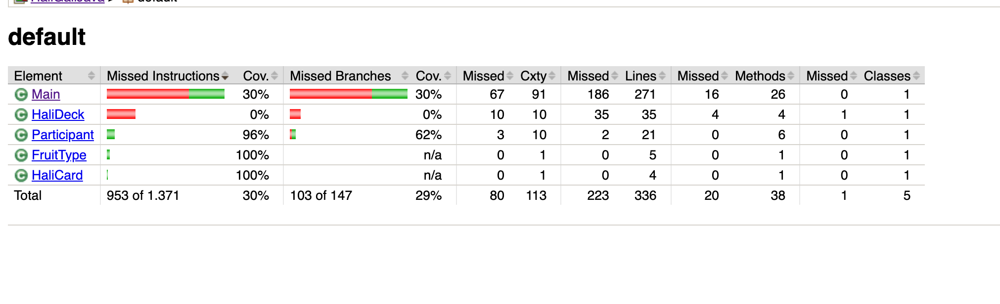

# Report for Assignment 1

## Project

Description: An implementation of the Halli Galli card game featuring a player versus multiple CPU opponents. It
includes game mechanics like card handling, bell-smacking logic, and participant elimination.

Programming language: Java

## Initial tests

### Tests

Located in src/test/java

- AreFiveFruitsPresent_TestA
- GrabAllTableCards_BasicTest
- ProcessCPUBellSmacking_BasicTest
- ProvidePlayerNameTest

### Coverage of initial tests

We used jacoco and gradle to do our initial tests. We created a build.gradle file that ensured we're using jacoco and
ran tests using the command line ./gradlew clean test jacocoTestReport. To know if the tests worked, we would navigate
to the index.html file found in HaliGaliJava/build/reports/tests/test and to see our coverage so far we would navigate
to the index.html file found in HaliGaliJava/build/reports/jacoco/test/html.

Initial Coverage:

## Coverage improvement

### Individual tests

Nada

Test 1: ResetGame_BasicTest

https://github.com/Cvndas/HaliGaliJava/commit/64296da77a90f8a5ca4e927a27d378601a0d4da6#diff-19c3fc0506bd3705a8cf376d79cc00f5ec27da80b00862df7c10edc1afca4076

Initial Coverage:

Post-test Coverage:

This test improved coverage by 50% because it actually runs ResetGame() with all the participant lists filled. It checks if the method really clears everything and returns true. Before this, those lines weren’t being tested. Now, the code that clears the lists and checks if they’re empty is being used, which explains the coverage boost. The overall coverage in Main was boosted from **14% to 26%** because of this test.

Test 2:  InitializeGame_BasicTest

https://github.com/Cvndas/HaliGaliJava/commit/a030034d65208985747dee845b9f71900e92d5d4#diff-2ddfc30ca3a82ccae3704265d860c49d75518cc5ddd911ebf6f17c4a546bb47f

Initial Coverage:

Post-test Coverage:

This test helped increase the coverage of InitializeGame() by about 57% because it actually ran the method with real input. I used System.setIn() to simulate typing "3" for the number of players and "PlayerName" for the name. Then I set up the scanner and called the method. The test checks if the method returns 3, meaning the input was processed correctly. By doing this, the test activated parts of the code that read input, set up players, and returned the count, which wasn’t being tested before. This test boosted the overall coverage in Main from **14% to 36%**, which is a big jump. This is because the InitializeGame() function is quite large and contains many branches.

### Thadeus

Test 1: AreFiveFruitsPresent_NullCardAndFourFruits_False()
https://github.com/Cvndas/HaliGaliJava/commit/72dba3295b935f31c7992ba60c3e952aac724002

Old coverage results

The coverage results with the modified test 1

Replacing the test from the batch of initial tests with the new test improved
coverage by 5%

I changed initial test to have a null card and 4 bananas. The coverage is improved because the "continue" path is being
hit by having a player  that does not have a card, as well as hitting other parts of the
function.

Test 2: AreFiveFruitsPresent_FiveFruits_True()
Link to commit: https://github.com/Cvndas/HaliGaliJava/commit/a3528202f793cfa1cba3fbdb76c0c2e6761b74a9

Old coverage results:

Coverage results with test 2 added

This test improves coverage by 5%. It does so by using a variety
of fruit types, hitting more lines within the switch statement. 

Test 3: ProgressTurnIndex_Tests()

Link to commit: https://github.com/Cvndas/HaliGaliJava/commit/a3528202f793cfa1cba3fbdb76c0c2e6761b74a9

Old coverage results

New coverage results:

This test improves coverage by 9%. It does so by maximizing the coverage of the ProgressTurnIndex() function.
This test was created by analyzing how the function works, and observing that the following must hold
for coverage to be maximum:
		- currentPlayerTurn input must be equal to allCpuParticipants.size()
		- The player must be dead
		- The next CPU must be dead
		- The CPU After the dead cpu is not dead.
The inputs within the test are crafted to match these properties.

## Amira

---

### Test 1: `ProcessUserBellSmacking_BasicTest`

**Commit:**  
[View on GitHub](https://github.com/Cvndas/HaliGaliJava/commit/f985b47)

**Coverage:**  
- **Old:**  
    
- **New:**  
  

**Improvement:**  
This test simulates a user smacking the bell during gameplay and evaluates whether the bell logic behaves correctly under valid and invalid fruit conditions.
It improved coverage of the Main class from **22% to 27%**, and also increased the Participant class coverage slightly (from 80% to 81%).
Overall, total project coverage improved from **23% to 27%**, confirming that the test successfully triggered branches that were not covered by the initial test set.

---
### Test 2: `Playgame_BasicTest`

**Commit:**
[View on GitHub](https://github.com/Cvndas/HaliGaliJava/commit/232a57f)

**Coverage:**
- **Old:**
  
- **New:**
  

**Improvement:**
This test simulates a full play sequence, involving both CPU and user actions, within the main game loop.
It significantly improved the instruction coverage of Main.java from 23% to 31%, and branch coverage from 16% to 26%.
Previously untested paths—like turn progression, victory checks, and participant updates—are now executed.
In total, the project gained 7% coverage, and 86 instructions were newly covered.

---

Sıla

TODO: Group member name

TODO: Test 1

TODO: Show a patch (diff) or a link to a commit made in your repository that shows the new test

TODO: Provide a screenshot of the old coverage results (the same as you already showed above)

TODO: Provide a screenshot of the new coverage results

TODO: State the coverage improvement with a number and elaborate on why the coverage is improved

Repeat for other tests...

### Overall

Initial Coverage:

As shown above, we have managed to increase the coverage from **16% to 57%**. This is an increase by a product of 3.5, which is a huge feat. This was made possible, because of the quality of our tests and the functions and their coding-depth we have tested on.

## Statement of individual contributions

Link to github repository: https://github.com/Cvndas/HaliGaliJava

| Member | Three functions (names with links to the code on the repository) created                                                                                                                                                        | Initial test (name)            | Other tests (names)                                                                          |
| --- |---------------------------------------------------------------------------------------------------------------------------------------------------------------------------------------------------------------------------------|--------------------------------|----------------------------------------------------------------------------------------------|
| Nada | GrabAllTableCards(), KickOutDeadParticipants(), ResetGame() https://github.com/Cvndas/HaliGaliJava/blob/main/src/main/java/Main.java#L197C2-L231C3 https://github.com/Cvndas/HaliGaliJava/blob/main/src/main/java/Main.java#L484C1-L496C1 | GrabAllTableCards_BasicTest    | ResetGame_BasicTest, InitializeGame_BasicTest                                                |
| Thadeus | InitializeGame(), GiveParticipantsInitialCards(),  ProgressTurnIndex(), and various other functions from the start of the project.      https://github.com/Cvndas/HaliGaliJava/blob/main/src/main/java/Main.java                                                                                        | AreFiveFruitsPresent_NoParticipants_False() | AreFiveFruitsPresent_FiveFruits_True(), AreFiveFruitsPresent_NullCardAndFourFruits_False() - This replaces my initial test - ,  ProgressTurnIndex_TwoDeadParticipants_2()|
| Amira |ProcessUserBellSmacking(), ProcessCPUBellSmacking() and HandleCorrectBellSmack() https://github.com/Cvndas/HaliGaliJava/blob/main/src/main/java/Main.java#L490-L562 |  ProcessCPUBellSmacking_BasicTest                      |  PlayGame_BasicTest, ProcessUserBellSmacking_BasicTest                                                                                                |
| Sıla |                                                                                                                                                                                                                                 |                                |                                                                                              |

