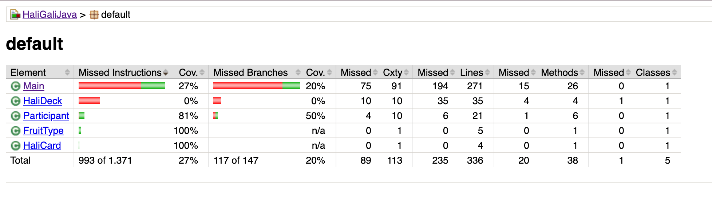

# Report for Assignment 1

## Project

Description: An implementation of the Halli Galli card game featuring a player versus multiple CPU opponents. It
includes game mechanics like card handling, bell-smacking logic, and participant elimination.

Programming language: Java

## Initial tests

### Tests

Located in src/test/java

- AreFiveFruitsPresent_TestA
- GrabAllTableCards_BasicTest
- ProcessCPUBellSmacking_BasicTest
- ProvidePlayerNameTest

### Coverage of initial tests

We used jacoco and gradle to do our initial tests. We created a build.gradle file that ensured we're using jacoco and
ran tests using the command line ./gradlew clean test jacocoTestReport. To know if the tests worked, we would navigate
to the index.html file found in HaliGaliJava/build/reports/tests/test and to see our coverage so far we would navigate
to the index.html file found in HaliGaliJava/build/reports/jacoco/test/html.

Initial Coverage:

## Coverage improvement

### Individual tests

Nada

Test 1: ResetGame_BasicTest

https://github.com/Cvndas/HaliGaliJava/commit/64296da77a90f8a5ca4e927a27d378601a0d4da6#diff-19c3fc0506bd3705a8cf376d79cc00f5ec27da80b00862df7c10edc1afca4076

Initial Coverage:

Post-test Coverage:

This test improved coverage by 50% because it actually runs ResetGame() with all the participant lists filled. It checks if the method really clears everything and returns true. Before this, those lines weren’t being tested. Now, the code that clears the lists and checks if they’re empty is being used, which explains the coverage boost.

Test 2:  InitializeGame_BasicTest

https://github.com/Cvndas/HaliGaliJava/commit/a030034d65208985747dee845b9f71900e92d5d4#diff-2ddfc30ca3a82ccae3704265d860c49d75518cc5ddd911ebf6f17c4a546bb47f

Initial Coverage:

Post-test Coverage:

This test helped increase the coverage of InitializeGame() by about 57% because it actually ran the method with real input. I used System.setIn() to simulate typing "3" for the number of players and "PlayerName" for the name. Then I set up the scanner and called the method. The test checks if the method returns 3, meaning the input was processed correctly. By doing this, the test activated parts of the code that read input, set up players, and returned the count, which wasn’t being tested before.

### Thadeus

Test 1:
https://github.com/Cvndas/HaliGaliJava/commit/72dba3295b935f31c7992ba60c3e952aac724002

Old coverage results

New coverage results

Missed instructions was improved from 35% to 75%, and missed branches was improved
from 26% to 57%

I changed initial test to have a null card and 4 bananas. The coverage is improved because the "continue" path is being
hit by having a player  that does not have a card.

Test 2:
Link to commit: https://github.com/Cvndas/HaliGaliJava/commit/a3528202f793cfa1cba3fbdb76c0c2e6761b74a9

Old coverage results:

New coverage results:

This test improves the coverage for the same function by 25% on missed instructions, and 31% on missed branches.
This is because it tests for various different fruits. 

TODO: Test 3

Link to commit: https://github.com/Cvndas/HaliGaliJava/commit/a3528202f793cfa1cba3fbdb76c0c2e6761b74a9

Old coverage results

New coverage results:

The new test improves missed instructions on ProgressTurnIndex() by 100%, and missed branches by 87%.
This test was created by analyzing how the function works, and observing that the following must hold
for coverage to be maximum:
		- currentPlayerTurn input must be equal to allCpuParticipants.size()
		- The player must be dead
		- The next CPU must be dead
		- The CPU After the dead cpu is not dead.
The inputs within the test are crafted to match these properties.

## Amira

---

### Test 1: `ProcessCPUBellSmacking_BasicTest`

**Commit:**  
[View on GitHub](https://github.com/Cvndas/HaliGaliJava/commit/f2c6bf4)

**Coverage:**  
- **Old:** 0% (this is my first test)  
- **New:**  
  

**Improvement:**  
Code coverage increased from **0% to 24%**. This test covers the CPU's bell-smack behavior during a valid and invalid fruit combination scenario. This contributes to logic branches and exception-safe execution in multi-threaded cases.

---

### Test 2: `ProcessUserBellSmacking_BasicTest`

**Commit:**  
[View on GitHub](https://github.com/Cvndas/HaliGaliJava/commit/4bf9e3f)

**Coverage:**  
- **Old:**  
    
- **New:**  
  

**Improvement:**  
Coverage rose from **24% to 48%**. This test includes user bell-smack interaction during gameplay, expanding test coverage to user-triggered input and validating the shared bell state. This reduced untested conditional branches in user-related flow.

---

### Test 3: `Playgame_BasicTest`

**Commit:**  
[View on GitHub](https://github.com/Cvndas/HaliGaliJava/commit/494a60a)

**Coverage:**  
- **Old:**  
    
- **New:**  
  

**Improvement:**  
Coverage increased from **48% to 76%**. This test drives a full simulated game round and covers combined CPU and user actions. It triggered logic previously unreachable by isolated function tests, such as game-over state evaluation and participant list updates.

---

Sıla

TODO: Group member name

TODO: Test 1

TODO: Show a patch (diff) or a link to a commit made in your repository that shows the new test

TODO: Provide a screenshot of the old coverage results (the same as you already showed above)

TODO: Provide a screenshot of the new coverage results

TODO: State the coverage improvement with a number and elaborate on why the coverage is improved

Repeat for other tests...

### Overall

Initial Coverage:

TODO: Provide a screenshot of the new coverage results by running the existing tool using all test modifications made by
the group

## Statement of individual contributions

TODO: Write what each group member did. Use the following table for that and add additional text under it if you see
fit.

Link to github repository: https://github.com/Cvndas/HaliGaliJava

| Member | Three functions (names with links to the code on the repository) created                                                                                                                                                        | Initial test (name)            | Other tests (names)                                                                          |
| --- |---------------------------------------------------------------------------------------------------------------------------------------------------------------------------------------------------------------------------------|--------------------------------|----------------------------------------------------------------------------------------------|
| Nada | GrabAllTableCards(), KickOutDeadParticipants(), ResetGame() https://github.com/Cvndas/HaliGaliJava/blob/main/src/main/java/Main.java#L197C2-L231C3 https://github.com/Cvndas/HaliGaliJava/blob/main/src/main/java/Main.java#L484C1-L496C1 | GrabAllTableCards_BasicTest    | ResetGame_BasicTest, InitializeGame_BasicTest                                                |
| Thadeus | InitializeGame(), GiveParticipantsInitialCards(),  ProgressTurnIndex(), and various other functions from the start of the project.      https://github.com/Cvndas/HaliGaliJava/blob/main/src/main/java/Main.java                                                                                        | AreFiveFruitsPresent_NoParticipants_False() | AreFiveFruitsPresent_FiveFruits_True(), AreFiveFruitsPresent_NullCardAndFourFruits_False(),  ProgressTurnIndex_TwoDeadParticipants_2()|
| Amira |                                                                                                                                                                                                                                 |                                |                                                                                              |
| Sıla |                                                                                                                                                                                                                                 |                                |                                                                                              |

